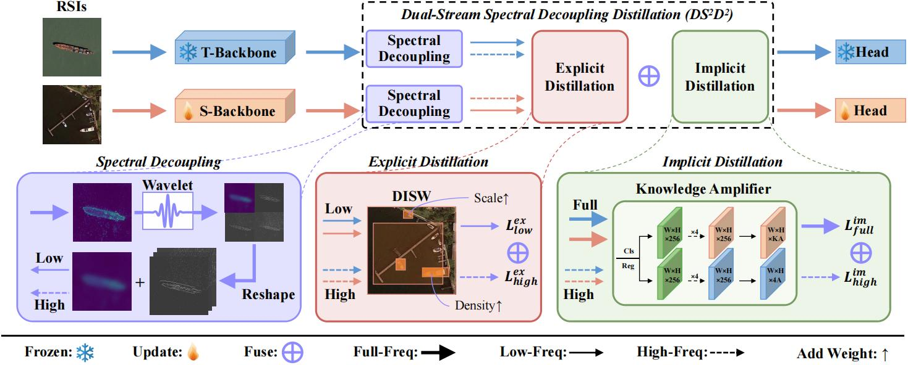

# $\rm DS^2D^2$

TGRS 2025 Paper: [Dual-Stream Spectral Decoupling Distillation for Remote Sensing Object Detection](https://ieeexplore.ieee.org/stamp/stamp.jsp?tp=&arnumber=11129064)

[ArXiv Version Links](https://arxiv.org/abs/2512.04413)

## Architecture
<p align="center"></p>

## Abstract
> Knowledge distillation is an effective and hardware-friendly method, which plays a key role in lightweighting remote sensing object detection.
	However, existing distillation methods often encounter the issue of mixed features in remote sensing images (RSIs), and neglect the discrepancies caused by subtle feature variations, leading to entangled knowledge confusion.
	To address these challenges, we propose an architecture-agnostic distillation method named Dual-Stream Spectral Decoupling Distillation (DS2D2) for universal remote sensing object detection tasks. Specifically, DS2D2 integrates explicit and implicit distillation grounded in spectral decomposition. Firstly, the first-order wavelet transform is applied for spectral decomposition to preserve the critical spatial characteristics of RSIs. Leveraging this spatial preservation, a Density-Independent Scale Weight (DISW) is designed to address the challenges of dense and small object detection common in RSIs. Secondly, we show implicit knowledge hidden in subtle student-teacher feature discrepancies, which significantly influence predictions when activated by detection heads. This implicit knowledge is extracted via full-frequency and high-frequency amplifiers, which map feature differences to prediction deviations. Extensive experiments on DIOR and DOTA datasets validate the effectiveness of the proposed method. Specifically, on DIOR dataset, DS2D2 achieves improvements of 4.2% in AP50 for RetinaNet and 3.8% in AP50 for Faster R-CNN, outperforming existing distillation approaches. The source code will be available at https://github.com/PolarAid/DS2D2.

## News
- [2025-12-05] Source code has been released.
- [2025-08-14] $\rm DS^2D^2$ has been accepted to TGRS 2025.

## Installation

This repo is based on [MMDetection 3.3.0](https://github.com/open-mmlab/mmdetection/tree/v3.3.0)

**Step 1.** Create a conda environment and activate it.
```bash
conda create -n DS2D2 python=3.10
conda activate DS2D2
```

**Step 2.** Install Python packages.
```bash
pip install numpy==1.26.0 opencv-python==4.9.0.80 pytorch-wavelets PyWavelets pycocotools==2.0.7
pip install torch==1.13.1+cu116 torchvision==0.14.1+cu116 torchaudio==0.13.1 --extra-index-url https://download.pytorch.org/whl/cu116
```

**Step 3.** Install MMCV
```
pip install -U openmim
mim install mmengine
mim install "mmcv==2.1.0"
```

**Step 4.** Install $\rm DS^2D^2$ from source.

```bash
git clone https://github.com/PolarAid/DS2D2.git
cd DS2D2
pip install -v -e .
```

## Distillation Examples
Assuming you have put the reformated dataset (exampled as DIOR) into (DATA_PATH) and have installed $\rm DS^2D^2$ into (DS2D2_PATH):
```
cd (DS2D2_PATH)
ln -s (DATA_PATH) ./

# train teacher
./tools/dist_train.sh configs/faster_rcnn/faster-rcnn_r101_fpn_2x_dior.py 4 --auto-scale-lr
mkdir ./work_dirs/ds2d2_faster-rcnn_r18_fpn_2x_dior/
cp -r ./work_dirs/faster-rcnn_r101_fpn_2x_dior/epoch_24.pth ./work_dirs/ds2d2_faster-rcnn_r18_fpn_2x_dior/teacher.pth

# train amplifier
./tools/dist_train.sh configs/distillation/ds2d2_faster-rcnn-amplifier_r101_fpn_2x_dior.py 4 --auto-scale-lr
cp -r ./work_dirs/ds2d2_faster-rcnn-amplifier_r101_fpn_2x_dior/epoch_24.pth ./work_dirs/ds2d2_faster-rcnn_r18_fpn_2x_dior/amplifier.pth

# train student
./tools/dist_train.sh configs/distillation/ds2d2_faster-rcnn_r18_fpn_2x_dior.py 4 --auto-scale-lr
```

## Citation
Please cite our paper in your publications if you find this repository useful.
```bibtex
@ARTICLE{DS2D2,
  author={Gao, Xiangyi and Zhao, Danpei and Yuan, Bo and Li, Wentao},
  journal={IEEE Transactions on Geoscience and Remote Sensing}, 
  title={Dual-Stream Spectral Decoupling Distillation for Remote Sensing Object Detection}, 
  year={2025},
  volume={63},
  number={},
  pages={1-11},
  keywords={Remote sensing;Feature extraction;Object detection;Training;Wavelet transforms;Optimization;Frequency-domain analysis;Semantics;Location awareness;Computational modeling;Knowledge distillation;object detection;remote sensing images (RSIs);spectral decomposition},
  doi={10.1109/TGRS.2025.3600098}}
```